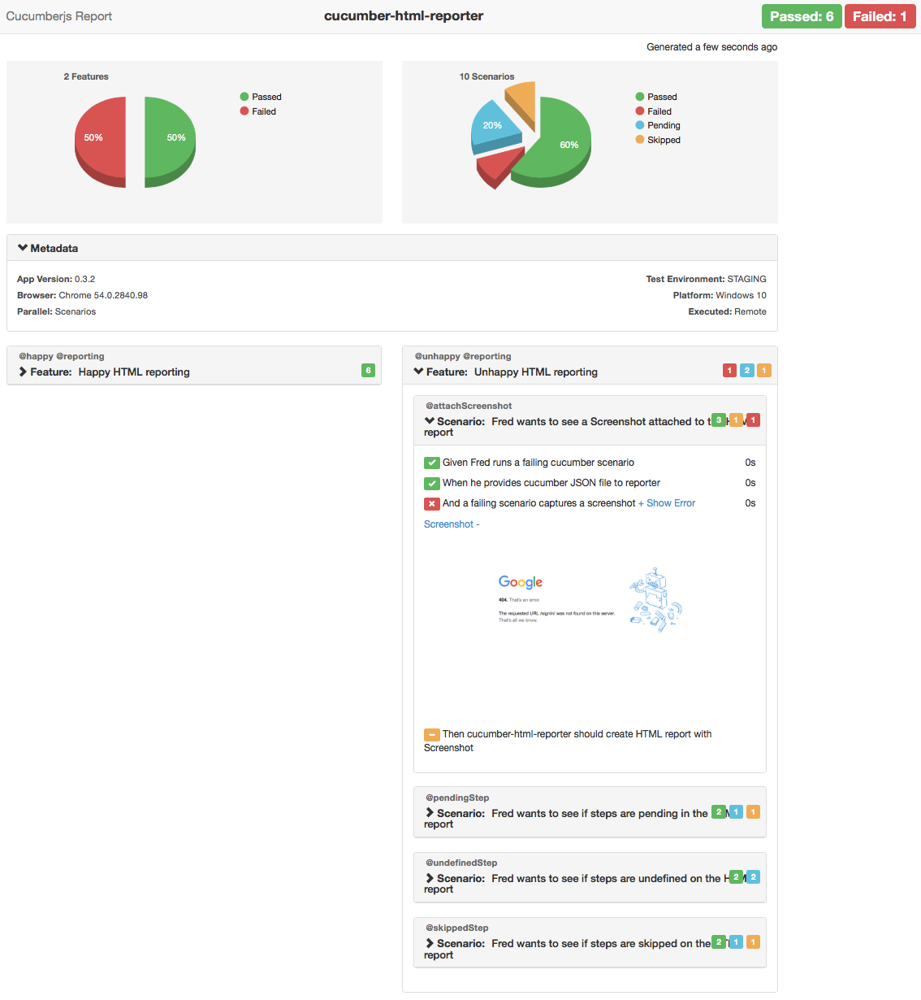

# klassijs-cucumber-html-reporter

***Generates HTML reports with pie charts for Cucumber***

 [](https://codeclimate.com/github/klassijs/klassi-js/maintainability)  [](https://github.com/klassijs/klassijs-cucumber-html-reporter/graphs/contributors)


> Available HTML themes: `['bootstrap', 'hierarchy', 'foundation', 'simple']`

## Preview of HTML Reports

Provide a Cucumber JSON report file created from your framework and this module will generate a pretty HTML report. Choose the best suitable HTML theme and dashboard for your CI from the available HTML reporter style.

1. [Bootstrap Theme Reports with Pie Chart][4]
2. [Hierarchical Feature Structure Theme Reports With Pie Chart][3]
3. [Foundation Theme Reports][5]
4. [Simple Theme Reports][6]


## Snapshot of Bootstrap Report


###### More snapshots are available [here][9]

## Install

``` bash
npm install klassijs-cucumber-html-reporter --save-dev
```

***Notes:***

* Latest version supports Cucumber v8
* Install `cucumber-html-reporter@5.5.0` for cucumber version `< Cucumber@8`


## Usage

Let's get you started:

1. Install the package through npm or yarn
2. Create a reporter.js and specify the options. Example of `hierarchy` theme:

```js

const reporter = require('klassijs-cucumber-html-reporter');

const reportOptions = {
        theme: 'hierarchy',
        jsonFile: 'reports/klassijs-cucumber_report.json',
        output: 'reports/klassijs-cucumber_report.html',
        reportSuiteAsScenarios: true,
        scenarioTimestamp: true,
        launchReport: true,
        metadata: {
            "App Version":"0.3.2",
            "Test Environment": "STAGING",
            "Browser": "Chrome  54.0.2840.98",
            "Platform": "Windows 10",
            "Parallel": "Scenarios",
            "Executed": "Remote"
        }
    };

    reporter.generate(reportOptions);
    

    //more info on `metadata` is available in `options` section below.

    //to generate consodilated report from multi-cucumber JSON files, please use `jsonDir` option instead of `jsonFile`. More info is available in `options` section below.

```
> Please look at the [Options](https://github.com/klassijs/klassijs-cucumber-html-reporter#options) section below for more options

3. Run the above code in a node.js script after Cucumber execution:
```bash
node index.js
```

#### For CucumberJS

This module converts Cucumber's JSON format to HTML reports. 
> The code has to be separated from CucumberJS execution (after it).

In order to generate JSON formats, run the Cucumber to create the JSON format and pass the file name to the formatter as shown below,

```bash
$ cucumberjs test/features/ -f json:test/report/cucumber_report.json
```

Multiple formatter are also supported,

```bash
$ cucumberjs test/features/ -f summary -f json:test/report/cucumber_report.json
```

> Are you using cucumber with other frameworks or running [cucumber-parallel][7]? Pass relative path of JSON file to the `options` as shown [here][8]


## Options

#### `theme`
Available: `['bootstrap', 'hierarchy', 'foundation', 'simple']`
Type: `String`

Select the Theme for your HTML report.

N.B: Hierarchy theme is best suitable if your features are organized under features-folder hierarchy. Each folder will be rendered as a HTML Tab. It supports up to 3-level of nested folder hierarchy structure.


#### `jsonFile`
Type: `String`

Provide path of the Cucumber JSON format file

#### `jsonDir`
Type: `String`

If you have more than one cucumber JSON files, provide the path of JSON directory. This module will create consolidated report of all Cucumber JSON files.

e.g. `jsonDir: 'test/reports'` //where _reports_ directory contains valid `*.json` files


N.B.: `jsonFile` takes precedence over `jsonDir`. We recommend to use either `jsonFile` or `jsonDir` option.


#### `output`
Type: `String`

Provide HTML output file path and name


#### `reportSuiteAsScenarios`
Type: `Boolean`
Supported in the Bootstrap theme.

`true`: Reports total number of passed/failed scenarios as HEADER.

`false`: Reports total number of passed/failed features as HEADER.

#### `launchReport`
Type: `Boolean`

Automatically launch HTML report at the end of test suite

`true`: Launch HTML report in the default browser at the end of test run

`false`: Do not launch HTML report at the end of test run

#### `ignoreBadJsonFile`
Type: `Boolean`

Report any bad json files found during merging json files from directory option.

`true`: ignore any bad json files found and continue with remaining files to merge.

`false`: Default option. Fail report generation if any bad files found during merge.

#### `name`
Type: `String` (optional)

Custom project name. If not passed, module reads the name from projects package.json which is preferable.

#### `brandTitle`
Type: `String` (optional)

Brand Title is the brand of your report, e.g. Smoke Tests Report, Acceptance Test Report etc as per your need. If not passed, it will be displayed as "Cucumberjs Report"

#### `columnLayout`
Available: `[1, 2]`
Type: `Number`
Default: 2

Select the Column Layout. One column or Two columns

1 = One Column layout  (col-xx-12)
2 = Two Columns Layout (col-xx-6)

#### `storeScreenshots`
Type: `Boolean`
Default: `undefined`

`true`: Stores the screenShots to the default directory. It creates a directory 'screenshot' if does not exists.

`false` or `undefined` : Does not store screenShots but attaches screenShots as a step-inline images to HTML report

#### `screenshotsDirectory`
Type: `String` (optional)
Default: `options.output/../screenshots`

Applicable if `storeScreenshots=true`. Relative path for directory where screenshots should be saved. E.g. the below options should store the screenshots to the `<parentDirectory>/screenshots/` where as the report would be at `<parentDirectory>/report/cucumber_report.html`

```js
{
   ...
   ...
   output: '/report/cucumber_report.html',
   screenshotsDirectory: 'screenshots/',
   storeScreenshots: true
}
```

#### `noInlineScreenshots`
Type: `Boolean`
Default: `undefined`

`true`: Applicable if `storeScreenshots=true`. Avoids inlining screenshots, uses relative path to screenshots instead (i.e. enables lazy loading of images).

`false` or `undefined`: Keeps screenshots inlined.

### `scenarioTimestamp`
Type: `Boolean`
Default: `undefined`

`true`: Applicable if `theme: 'bootstrap'`. Shows the starting timestamp of each scenario within the title.

`false` or `undefined`: Does not show starting timestamp.

#### `metadata`
Type: `JSON` (optional)
Default: `undefined`

Print more data to your report, such as _browser info, platform, app info, environments_ etc. Data can be passed as JSON `key-value` pair. Reporter will parse the JSON and will show the _Key-Value_ under `Metadata` section on HTML report. Checkout the below preview HTML Report with Metadata.

Pass the _Key-Value_ pair as per your need, as shown in below example,

```js

 metadata: {
        "App Version":"0.3.2",
        "Test Environment": "STAGING",
        "Browser": "Chrome  54.0.2840.98",
        "Platform": "Windows 10",
        "Parallel": "Scenarios",
        "Executed": "Remote"
      }

```

* [HTML Report Preview with Metadata][4]
* [Report Snapshot with Metadata][11]


## Tips

#### Attach Screenshots to HTML report

Capture and Attach screenshots to the Cucumber Scenario and HTML report will render the screenshot image

**for Cucumber v8**
```javascript

  const world = this;

  if (scenario.result.status === Status.FAILED) {
    return browser.takeScreenshot().then((screenShot) => {
      // screenShot is a base-64 encoded PNG
      world.attach(screenShot, 'image/png');
    });
  }

```

**for Cucumber < v8**
```javascript

  let world = this;
  
  if (scenario.result.status === Status.FAILED) {
    browser.takeScreenshot().then(function (buffer) {
      return world.attach(buffer, 'image/png');
    };
  }
```

#### Attach Plain Text to HTML report

Attach plain-texts/data to HTML report to help debug/review the results

```javascript

  scenario.attach('test data goes here');

```

#### Attach pretty JSON to HTML report

Attach JSON to HTML report

```javascript

  scenario.attach(JSON.stringify(myJsonObject, undefined, 4));

```
## Credits
Created by [Kushang Gajjar](https://github.com/gkushang)

## Changelog
[changelog][10]


[1]: https://www.npmjs.com/package/grunt-cucumberjs "grunt-cucummberjs"
[2]: https://github.com/cucumber/cucumber-js "CucumberJs"
[3]: http://htmlpreview.github.io/?https://github.com/klassijs/klassijs-cucumber-html-reporter/blob/develop/samples/html_reports/cucumber_report_hierarchy.html "Hierarchy Theme Reports"
[4]: http://htmlpreview.github.io/?https://github.com/klassijs/klassijs-cucumber-html-reporter/blob/develop/samples/html_reports/cucumber_report_bootstrap.html "Bootstrap Theme Reports"
[5]: http://htmlpreview.github.io/?https://github.com/klassijs/klassijs-cucumber-html-reporter/blob/develop/samples/html_reports/cucumber_report_foundation.html "Foundation Theme Reports"
[6]: http://htmlpreview.github.io/?https://github.com/klassijs/klassijs-cucumber-html-reporter/blob/develop/samples/html_reports/cucumber_report_simple.html "Simple Theme Reports"
[7]: https://www.npmjs.com/package/cucumber-parallel "cucumber-parallel"
[8]: https://github.com/klassijs/klassijs-cucumber-html-reporter/blob/develop/test/features/step_definitions/hooks.js#L13-L44
[9]: https://github.com/klassijs/klassijs-cucumber-html-reporter/blob/develop/samples/snapshots.md
[10]: https://github.com/klassijs/klassijs-cucumber-html-reporter/blob/develop/CHANGELOG.md
[11]: https://github.com/klassijs/klassijs-cucumber-html-reporter/blob/develop/samples/snapshots.md#with-metadata
[twitter]: https://twitter.com/larryg_01


